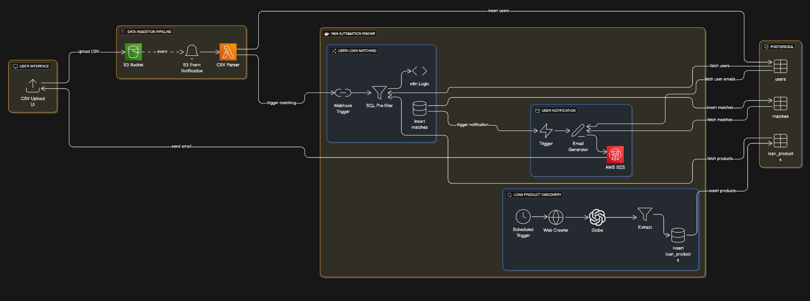

# ClickPe.ai Project🎯

An automated system that ingests user data, discovers personal loan products from public websites, matches users to eligible products, and notifies them of opportunities through a serverless, event-driven architecture.

## Overview

ClickPe.ai streamlines the loan product discovery process by automating user data ingestion, eligibility evaluation, and notification delivery. Users upload CSV files containing their financial information, and the system automatically matches them with suitable loan products based on predefined eligibility criteria.

## ✨ Key Features

- **CSV Data Ingestion** – Drag-and-drop file upload interface with validation for user profile data
- **Automated Eligibility Matching** – n8n orchestrates rule-based matching of users against loan product criteria
- **Secure File Upload** – Presigned S3 URLs prevent credential exposure while enabling direct file uploads
- **Event-Driven Processing** – S3 triggers automatically process new CSVs without manual intervention
- **Serverless Architecture** – AWS Lambda functions scale automatically based on demand
- **Production-Ready Infrastructure** – Terraform IaC with VPC configuration, Traefik reverse proxy, and auto-SSL via Let's Encrypt
- **Real-Time Notifications** – Users are notified of matched loan products via email

## 🏗️ Architecture

The system comprises three main tiers:

1. **Frontend** (Next.js/TypeScript) – Web interface for CSV uploads and user interaction
2. **Backend** (AWS Lambda/Go) – Processing pipeline with three Lambda functions:
   - `generatePresignedUrl` – Creates temporary S3 upload URLs
   - `processCsv` – Parses CSV files and persists user data to PostgreSQL
   - `triggerMatching` – Initiates n8n eligibility workflow
3. **Orchestration** (n8n) – Workflow automation for loan discovery and eligibility evaluation
4. **Infrastructure** – PostgreSQL database, S3 storage, Traefik proxy with HTTPS

## 🚀 Getting Started

### Prerequisites
- Node.js 18+ (Frontend)
- Go 1.21+ (Backend)
- AWS Account with appropriate permissions
- PostgreSQL database
- n8n instance
- Terraform (for infrastructure)

### Installation

**Frontend:**
```bash
cd frontend
pnpm install
pnpm run dev
```

**Backend:**
```bash
cd backend
make build
```

**Infrastructure:**
```bash
cd backend/terraform
terraform init
terraform plan
terraform apply
```

## ⚙️ Configuration

Set the following environment variables:

```bash
# Database
DB_HOST=your-db-host
DB_NAME=loan_eligibility
DB_USER=postgres
DB_PASSWORD=your-password

# AWS
AWS_REGION=us-east-1
S3_BUCKET=your-bucket-name

# n8n Integration
N8N_WEBHOOK_URL=https://your-n8n-instance/webhook/your-webhook-id
```

## 📋 Data Flow




## 🛠️ Tech Stack

- **Frontend:** Next.js, TypeScript, React Hook Form, Radix UI
- **Backend:** Go, AWS Lambda, AWS S3
- **Orchestration:** n8n
- **Database:** PostgreSQL
- **Infrastructure:** Terraform, Traefik, Docker
- **Deployment:** Serverless Framework, AWS

## 📝 Contributing

Contributions are welcome! Please feel free to submit a Pull Request.

## 📄 License

This project is licensed under the MIT License.

---

**Repository:** [github.com/Adityaadpandey/clickpe.ai](https://github.com/Adityaadpandey/clickpe.ai)

---

<h2 align="center"> Made with ❤️ using <strong>NOVA</strong><br> by <a href="https://adpandey.com">Aditya</a> </h2>
